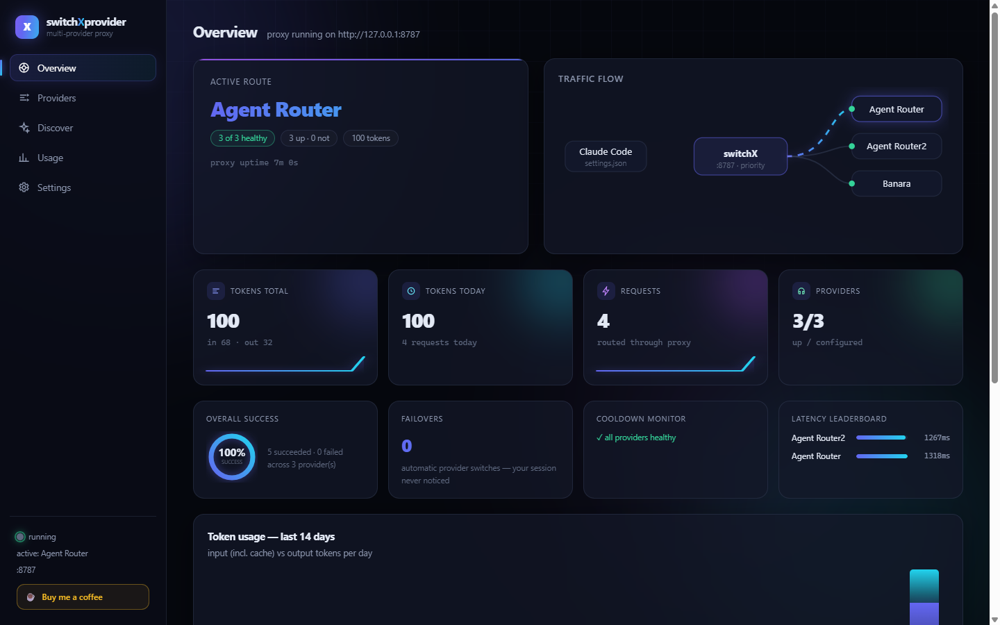
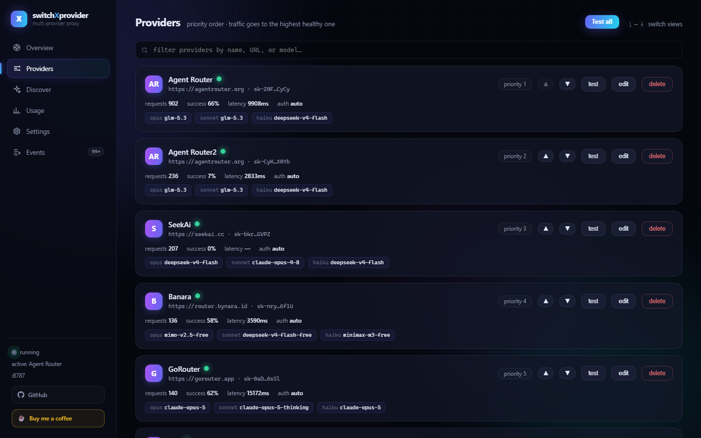
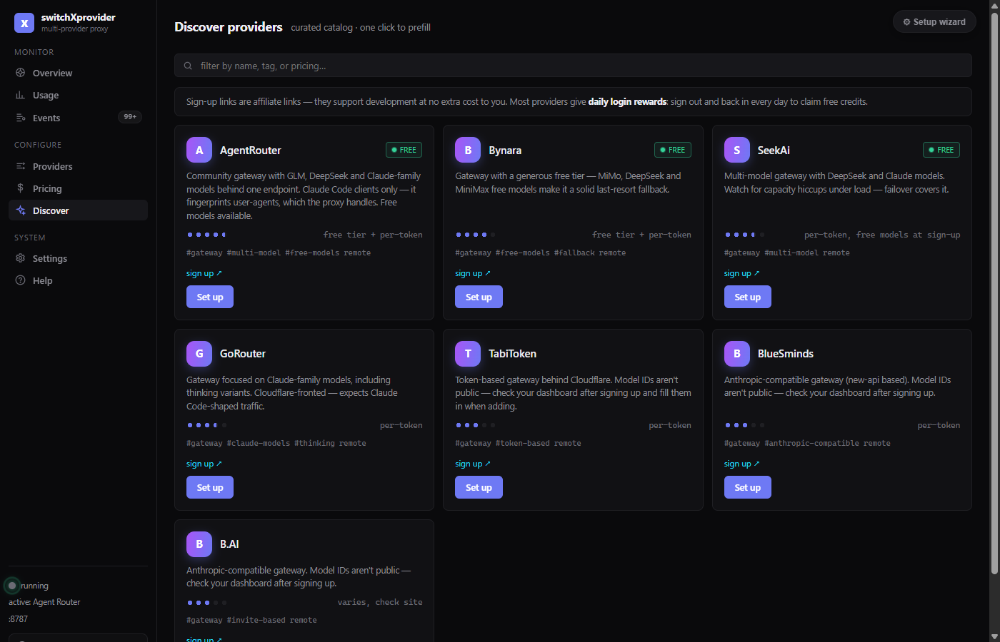
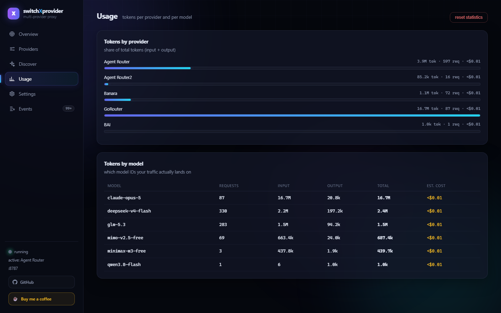
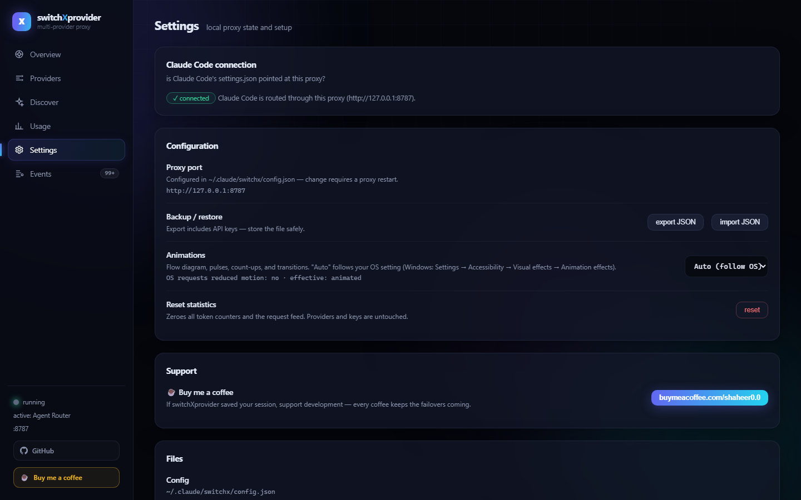

# switchXprovider

[](LICENSE)
[](package.json)
[](package.json)
[](https://buymeacoffee.com/shaheer0.0)

A Claude Code plugin that acts as a local API router — an alternative to OmniRouter. Claude Code always talks to `http://127.0.0.1:8787`; the plugin forwards traffic to whichever provider is active, switches automatically when a provider dies, and recovers automatically when it comes back.



<details>
<summary><b>More screenshots</b></summary>

| Providers — priority & failover state | Discover — curated catalog |
|---|---|
|  |  |

| Usage — per provider & model | Settings |
|---|---|
|  |  |

</details>

## How it differs from OmniRoute

Both projects solve "never stop coding when a provider dies" — but with opposite trust models. **OmniRoute pools free community tokens and routes your traffic through their infrastructure. switchXprovider routes your traffic directly to providers you control.**

| | switchXprovider | OmniRoute |
|---|---|---|
| **Traffic path** | Claude Code → your machine → your provider, directly | Claude Code → OmniRoute's gateway → pooled providers |
| **Keys** | Yours only — never leaves your `~/.claude` | Pooled community keys handled by their service |
| **Free tokens** | Depends on your providers' free tiers | ~1.5B/month pooled across 352+ providers |
| **Footprint** | One Node process, 0 dependencies, ~10 files | Full gateway infrastructure |
| **Auditability** | ~1,800 lines you can read in an afternoon | Centralized service |
| **Provider choice** | Any Anthropic-compatible endpoint you have a key for | Their supported provider pool |
| **Usage analytics** | Token/latency/success tracking of *your* traffic, locally | Gateway-side stats |
| **Cost** | Free (your provider usage) | Free tier + premium |

**Pick switchXprovider if:** you have provider keys or subscriptions (Anthropic, Z.AI GLM coding plan, DeepSeek, OpenRouter, gateways), want your API traffic to go straight to the provider with no middleman, and want a tiny auditable proxy instead of a service.

**Pick OmniRoute if:** you have no keys at all and want free pooled community tokens, accepting a third party in the path.

They also compose — run OmniRouter as one provider entry in switchXprovider, and its outage fails over to your backup key automatically.

## Install

**Via plugin marketplace (recommended):**

```
/plugin marketplace add shaheer-00/switchXprovider
/plugin install switchXprovider@switchx-marketplace
```

Then run `/switchx-install` — it walks you through the whole setup (proxy start, adding a provider, switching settings.json over) and refuses to break your setup along the way.

**Local, without the marketplace:**

```
git clone https://github.com/shaheer-00/switchXprovider
/plugin marketplace add /path/to/switchXprovider
/plugin install switchXprovider@switchx-marketplace
```

**Standalone (no plugin registration — dashboard and proxy only, no slash commands or auto-start hook):**

```
git clone https://github.com/shaheer-00/switchXprovider
node switchXprovider/server/ensure.mjs
```

## What it does

- **Set-and-forget Claude Code config** — `~/.claude/settings.json` is written once (by the installer) with sentinel model names. Provider switches never touch it again, and no Claude Code restart is needed to fail over.
- **Priority routing** — you set the provider order (1 = highest). Traffic always goes to the highest-priority *healthy* provider.
- **Automatic failover** — on failure the same request is retried on the next provider in the priority list:
  | Signal | Meaning | Base cooldown |
  |---|---|---|
  | 401 / 403 | bad or revoked key | 60 min |
  | 402 | out of credits | 30 min |
  | 429 | rate limited / usage window | 5 min (respects `retry-after`) |
  | 404 | model missing on provider | 2 min |
  | 5xx / 529 | provider trouble | 1 min |
  | network / timeout | unreachable | 30 s |
- **Auto-learning cooldowns** — cooldowns scale up to 8× with consecutive failures (exponential backoff), and honor upstream `retry-after` headers. Each provider tracks requests, success rate, and EMA latency.
- **Auto-recovery** — a background health probe re-tests down providers just before their cooldown expires; a recovered provider returns to rotation automatically at its priority (e.g. when your Claude subscription window resets, you drift back to provider #1 with zero action).
- **Usage analytics** — the proxy reads token usage (`input`/`output`/`cache_read`/`cache_creation`) out of every response — streaming and non-streaming — without touching the stream, and tracks totals per provider, per model, and per day. The dashboard shows animated stat cards, a 14-day usage chart, per-provider token share, a per-model table, and a live request feed (model, tokens, latency, status).
- **Provider discovery** — a curated catalog of gateways (AgentRouter, Bynara, SeekAi, GoRouter, TabiToken, BlueSminds, B.AI, …) with descriptions, ratings, pricing notes, and one-click prefill of the add-provider form. A remote catalog (same JSON schema, e.g. a raw GitHub file) can be set in Settings and overrides matching entries — useful for community-maintained lists.

> **Affiliate disclosure:** sign-up links in the Discover catalog are affiliate/referral links — signing up through them supports switchXprovider development at no extra cost to you.
>
> **Daily login rewards:** most of these providers hand out free credits or tokens for a daily check-in — you have to sign out and sign back in **every day** to claim them. Worth it if you're running free-tier models.
- **Config backup** — export/import the full provider list (including keys) as JSON from the dashboard.
- **Install status detection** — the dashboard reads `~/.claude/settings.json` and shows whether Claude Code is actually routed through the proxy.
- **Deadlock protection** — if *every* provider is down, cooldowns reset once and the request is retried rather than hard-failing.

## Setup

**Order matters.** The moment `settings.json` points at the proxy, ALL Claude Code traffic goes through it — if no provider is configured yet, Claude Code is completely stuck with no API access. So the installer runs checks and **refuses to touch `settings.json` until the proxy is running and at least one enabled provider has an API key**.

Correct order:

```
node server/ensure.mjs       # 1. start the proxy (daemonizes)
open http://127.0.0.1:8787   # 2. add a provider (API key + model IDs), click "test"
node scripts/install.mjs     # 3. NOW switch Claude Code to the proxy (backs up settings.json)
                             # 4. restart Claude Code
```

Or as a plugin: the `SessionStart` hook auto-starts the proxy, and `/switchx-install` runs the installer with the same checks. `--force` skips them.

> **If Claude Code gets stuck after installing:** restore the backup —
> `copy ~/.claude/settings.json.switchx-backup ~/.claude/settings.json` — then fix the provider in the dashboard and re-run the installer.
>
> Shell/system `ANTHROPIC_*` environment variables override `settings.json` — remove them or nothing here takes effect. The installer warns about conflicts it can see.

## Use

- **Dashboard:** http://127.0.0.1:8787 — add/edit/delete providers, reorder priority (▲▼), test connectivity, watch status and the event log live.
- **Commands:** `/switchx` (status), `/switchx-add` (add provider), `/switchx-install` (run installer).
- **Config lives in** `~/.claude/switchx/config.json` (providers + keys + stats). Server log: `~/.claude/switchx/server.log`.

## Adding a provider

In the dashboard or via `POST /api/providers`:

| Field | Notes |
|---|---|
| `baseUrl` | e.g. `https://api.anthropic.com`, `https://openrouter.ai/api/v1` — `/v1` duplication is handled |
| `apiKey` | provider key |
| `authStyle` | `auto` (default — sends both header styles, works everywhere), or force `anthropic` / `bearer` for rare strict providers |
| `models` | real model IDs for the `opus` / `sonnet` / `haiku` slots — the proxy maps `switchx:sonnet` → your value |

## How the model mapping works

Claude Code sends `model: "switchx:sonnet"` (or opus/haiku) because that's what the installer put in `settings.json`. The proxy rewrites `switchx:<slot>` to the active provider's model for that slot before forwarding, so every provider can use completely different model names — including non-Anthropic gateways that expose Anthropic-compatible `/v1/messages` endpoints.

## Security

- Proxy binds to **127.0.0.1 only** — never reachable from the network.
- API keys are stored in plaintext in `~/.claude/switchx/config.json` (same trust level as your `~/.claude` directory) and are masked in all API/dashboard responses.

## Remote catalog schema

Host a JSON file (e.g. `catalog.json` in a GitHub repo, served via `raw.githubusercontent.com`) and paste its URL into Settings → Remote catalog. Entries with the same `id` as the built-in catalog override it:

```json
{
  "version": 1,
  "updated": "2026-09-05",
  "providers": [
    {
      "id": "my-gateway",
      "name": "My Gateway",
      "baseUrl": "https://api.example.com",
      "authStyle": "auto",
      "description": "What it is and why you'd use it.",
      "website": "https://example.com",
      "docsUrl": "https://docs.example.com",
      "pricing": "per-token | subscription | free",
      "freeTier": true,
      "rating": 4.5,
      "tags": ["community"],
      "models": { "opus": "...", "sonnet": "...", "haiku": "..." }
    }
  ]
}
```

`id`, `name`, `baseUrl` are required; everything else is optional. Ratings are editorial — set them yourself for your community.

## Support

If switchXprovider saves your session, consider supporting development: ☕ **[Buy me a coffee](https://buymeacoffee.com/shaheer0.0)**

## Files

```
.claude-plugin/plugin.json   plugin manifest + SessionStart hook (auto-start)
server/server.mjs            HTTP server: dashboard / API / proxy routing
server/ensure.mjs            daemon bootstrap (used by the hook)
server/lib/config.mjs        config + stats + event log (~/.claude/switchx/)
server/lib/proxy.mjs         forwarding, model rewrite, failover, cooldowns
server/lib/health.mjs        background probes, auto-recovery
server/lib/api.mjs           management REST API
public/index.html            dashboard (single file, no external assets)
commands/switchx*.md         slash commands
scripts/install.mjs          one-time settings.json installer
test/run-tests.mjs           end-to-end tests (failover, mapping, recovery)
```
